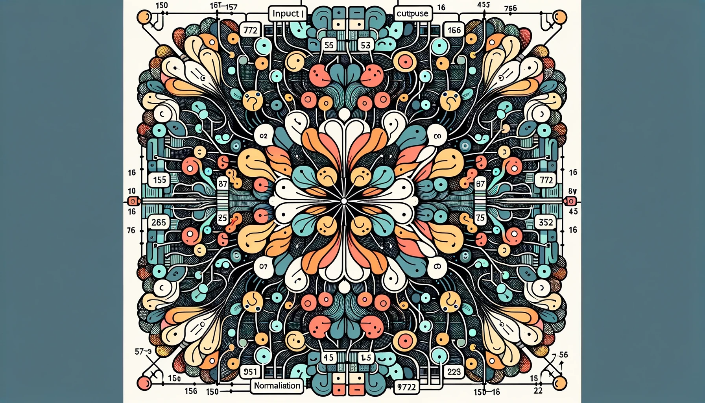
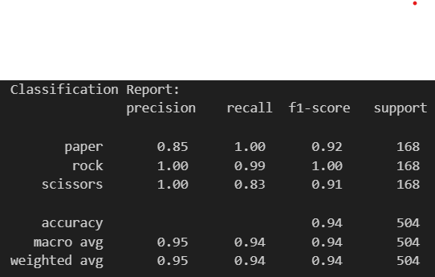

# Rock Paper Scissors Prediction

## Overview

Project ini adalah untuk tugas pratikum mata kuliah Machine Learning Fakultas Teknik Informatika UMM
**_Link Dataset yang digunakan :_** [rps dataset](https://drive.google.com/drive/folders/1kgyN9Ah_w6MvxsRxANh3TfB9S-bCVZMv).

Preprocessing yang digunakan : Konversi mode warna BGR ke RGB dan Grayscale, Pengubahan ukuran, Konversi ke array, Ekspansi dimensi, Normalisasi

Model yang digunakan : Pre Trained Method yaitu MobileNetV2 dan ResNet50 dengan arsitektur seperti gambar di bawah ini

MobileNetV2

ResNet50

**Akurasi** yang didapatkan dengan menggunakan model MobileNetV2 dan Resnet50 adalah : **100%** dan **94%**

## Overview Dataset

**_Link Dataset yang digunakan :_** [rps dataset](https://drive.google.com/drive/folders/1kgyN9Ah_w6MvxsRxANh3TfB9S-bCVZMv).
Gambar yang digunakan adalah Rock, Paper dan Scissors dengan total gambar 2.520 gambar. Terdiri dari 840 gambar jenis Rock, 840 gambar jenis Paper dan 840 gambar jenis Scissors

Splitting Dataset : Training = 80%, Validation = 20%

## Preprocessing dan Modelling

- **Preprocessing Model** : resize(100,100), rescale=1./255, rotation_range=40, width_shift_range=0.2, height_shift_range=0.2, shear_range=0.2, zoom_range=0.2, horizontal_flip=True, fill_mode='nearest'

- Modelling Model MobileNetV2 :

  Summary Model MobileNetV2 :

  

  Graph Accuracy dan Loss MobileNetV2 :

  
  

  Classification Report Model MobileNetV2 :

  

- Modelling Model ResNet50 :

  Summary Model ResNet50 :

  

  Graph Accuracy dan Loss ResNet50 :

  
  

  Classification Report Model ResNet50 :

  

  ## Predict Data

- Predict Data dengan Model MobileNetV2 :

1. 

2. 

3. 

- Predict Data dengan Model ResNet50 :

1. 

2. 

3. 

## Local Development

